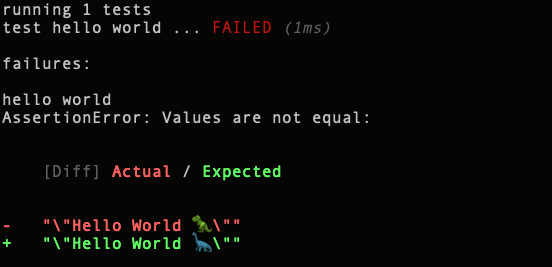
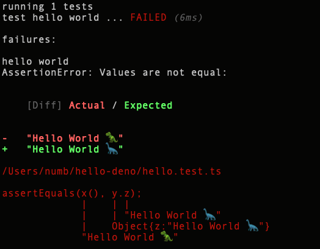

<div align="center">
  <h1>Power Assert Deno</h1>
  <p>Power Assert in Deno. When the test fails, you can get descriptive information.</p>
  <a href="https://github.com/numb86/power-assert-deno/releases/latest/">
    
  </a>
  <a href="https://github.com/denoland/deno">
    
  </a>
  <a href="./LICENSE">
    
  </a>
</div>

Without Power Assert



With Power Assert



Getting descriptive information, thereby will make your development more efficient.

## Using

1. Install

```
$ deno install -n assert -f --allow-read --allow-write --allow-run --unstable https://deno.land/x/power_assert_deno@0.1.0/cli.ts
```

You can now use the command `assert`.  
Can give it any name with the `-n` flag.  
For example, if use `-n test` instead of `-n assert`, the command will be named `test`.

2. Use dedicated assertions instead of standard assertions

```diff
- import { assert, assertEquals } from "https://deno.land/std/testing/asserts.ts";
+ import { assert, assertEquals } from "https://deno.land/x/power_assert_deno@0.1.0/mod.ts";
```

Done!

Just run your test with the `assert` command.  
For example, to run the tests located in the `src/` directory, run the following command.

```
$ assert src/
```

**Note:** If you get an error about main thread, running it with the `--reload` flag may work.

## sample

You can try it out without installing it with the following command.

```
$ git clone git@github.com:numb86/power-assert-deno.git
$ cd power-assert-deno
$ deno run --allow-read --allow-write --allow-run --unstable cli.ts sample/
```

## Excellent precedent and porting origin

The concept of "Power Assert" is implemented in various languages.

In my case, first encountered "Power Assert" in the [Node.js](https://github.com/power-assert-js).  
The motivation for starting to develop this module was to want to take advantage of this great feature in Deno as well.  
It was also very helpful in development of this module.

## License

Copyright 2020-present numb86. All rights reserved. MIT license.
